# 📘 Blueprint Function Reference

This section lists all Blueprint-accessible functions provided by SaveKit Lite, grouped by category.

---

## 🔹 Category: Save Kit → Slots

### `GetExistingSaveSlots()`
- Returns: `Array of Strings`
- Description: Lists all save slot names found in the save directory.


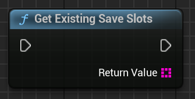


### `GetSaveSlotInfos()`
- Returns: `Array of SaveSlotInfo Structures`
- Description: Returns metadata for all existing save slots (slot name, save time, save version).


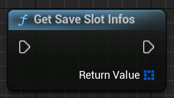


### `LoadSaveMeta(SlotName)` *(see also: `ui.md` for usage in preview)*
- Input: `FString SlotName`
- Returns: `SaveSlotInfo Structure`
- Description: Returns metadata only — does NOT load or apply saved state.


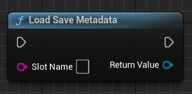


---

## 🔹 Category: Save Kit

### `SaveGame(SlotName, ``SaveVersion``)`
- Input: `FString SlotName`, `int32 ``SaveVersion``` (optional)
- Description: Saves all actors with a Saveable component to the specified slot.


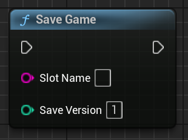


### `LoadGame(SlotName)`
- Input: `FString SlotName`
- Description: Loads and applies saved actor data from the specified slot.


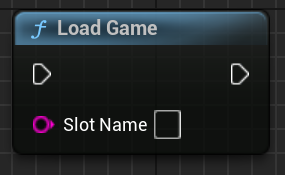


---

## 🔹 Category: Save Kit → Saveable (component functions)

### `SetVariable(Name)`
- Description: Sets a string variable in the Saveable component.


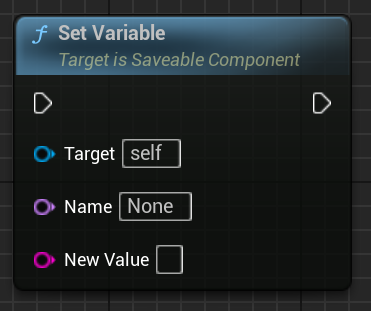


### `GetVariable(Name)`
- Description: Gets the string value of a saved variable.


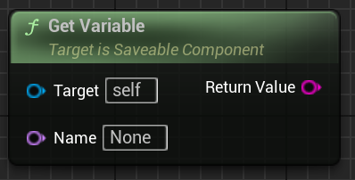


### `GetVariableAsInt(Name)`
- Description: Parses the variable’s value as an integer and returns it.


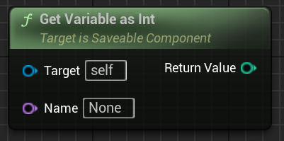


### `HasVariable(Name)`
- Description: Checks whether a variable with the specified name exists.


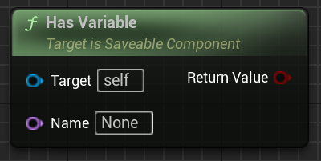


### `IncrementVariable(Name)`
- Description: Adds the specified amount to the variable’s value (as number).


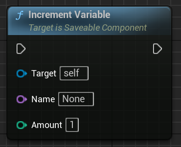


### `RemoveVariable(Name)`
- Description: Removes the variable from saved state.


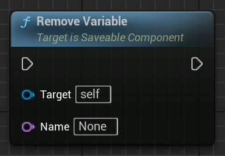


---

### 🧱 Save Slot Info Object

### `Init(SlotName, Time, Version)`
- Description: Initializes a SaveSlotInfoObject with name, time and version.


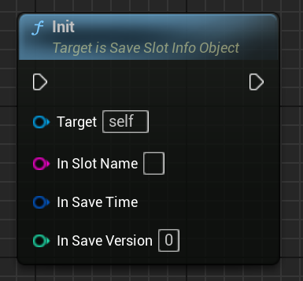


---

## 📦 Notes

- All function categories are searchable using context-sensitive Blueprint menus.
- You can use these functions inside UMG widgets, level Blueprints, or actor graphs.
