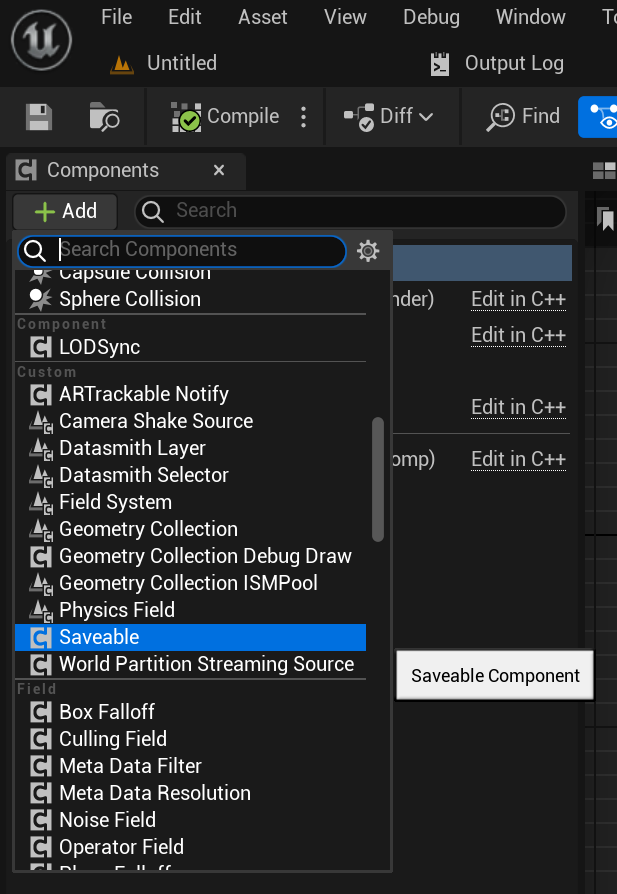
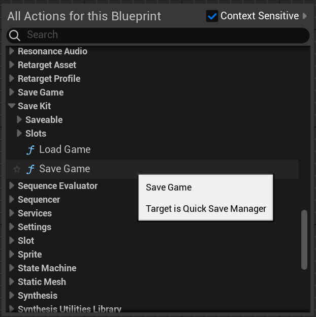

# 🧠 SaveKit Lite – Blueprint-Only Save System

**SaveKit Lite** is a minimalist, plug-and-play save/load system built entirely with Blueprints for Unreal Engine 5.

It allows you to save and load:

- 🎮 Actor transform (location, rotation, scale)
- 🧠 Custom string variables (like score, health, state)
- 🏷️ Actor tags and properties marked as `SaveGame`
- 💾 Metadata about save slots for UI display

---

## 🔧 Quick Start

To get started:

1. Add `Saveable` to any actor

2. Use `Save Kit → SaveGame(SlotName)` and `LoadGame(SlotName)` Blueprint nodes

3. ✅ Done! Your actor state is now persistent

---

## 💡 Why SaveKit Lite?

Unlike Unreal Engine's native Save Game system, SaveKit Lite gives you:

- 🧩 Actor-level saving with no custom classes
- 🔁 Built-in transform & tag support
- 📦 Key-value variable system for runtime data
- 📊 Metadata for UI display (slot name, version, timestamp)
- 🎯 Fully Blueprint-based, no coding required

Want to know more? See the [Comparison with UE Save System](comparison.md) *(this file is part of the documentation bundle)*

---

> 📦 *SaveKit Lite is designed to be simple and extendable — ideal for indie projects, prototyping, and modular virtual world systems.*