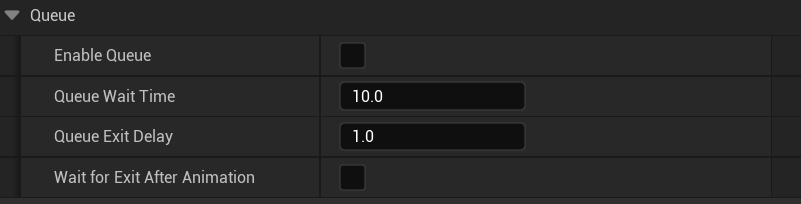
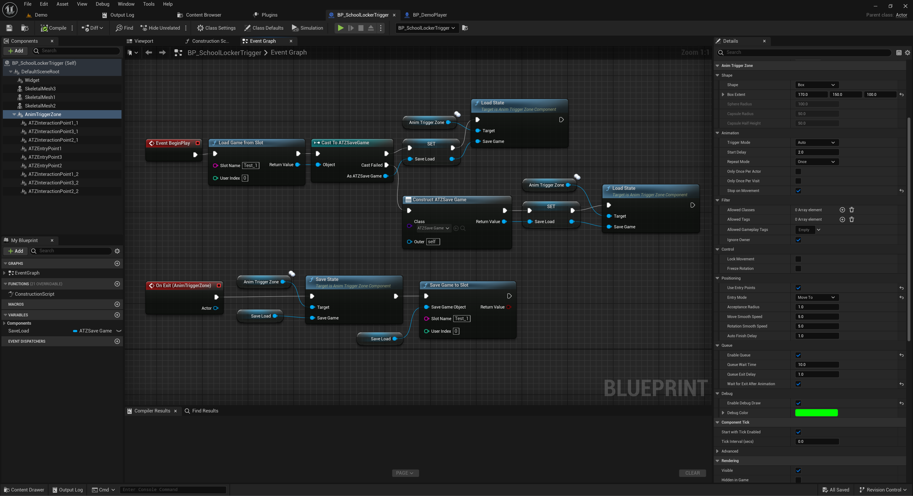
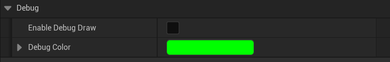

# Advanced Features

This section covers powerful features such as actor queuing, state saving, multiplayer replication, and debugging tools.

---

## Queuing System

The plugin supports multiple actors waiting for a free entry point.

### How it works

1. If all entry points are occupied, incoming actors are added to the **queue**.
2. When a spot frees up, the next actor is triggered.

### Settings

- **Enable Queue** — turns the queue system on.
- **Queue Wait Time** — how long an actor can wait before being auto-removed.
- **Queue Exit Delay** — delay between previous actor exiting and next one starting.
- **Wait For Exit After Animation** — ensures the next actor only enters after the previous actor fully leaves the trigger zone.



### Events

- `OnQueueEnter` — actor was added to the queue.
- `OnQueueExit` — actor left the queue (either to animate or by timeout).

You can also receive these via `ATZCharacterInterface`.

📌 Queuing only works when **Use Entry Points** is enabled.

---

## Saving and Loading State

The plugin includes built-in support for persistent trigger states.

### Use Case

- Prevent an actor from re-triggering a zone across save games.
- Preserve the queue and entry assignments.

### How to use

1. Create a Blueprint or C++ SaveGame class using `ATZSaveGame`.
2. Before saving:
   ```blueprint
   Call → Zone Component → Save State (SaveGameObject)
   ```
3. After loading:
   ```blueprint
   Call → Zone Component → Load State (SaveGameObject)
   ```

Each zone stores its state under its full path name.



---

## Multiplayer & Replication

The `AnimTriggerZone` component is fully network-replicated.

- Zone state, animation triggering, and interaction events are synchronized.
- Server-side authority is required to trigger most actions.

📌 Ensure the owning actor is also set to **replicates** and is placed properly in the level.

---

## Debug Visualization

You can enable zone visualization during play for easier testing.

- **Enable Debug Draw** — turns on runtime drawing.
- **Debug Color** — the color of the zone shape and points.



### What is visualized

- The zone shape (box/sphere/capsule)
- Entry points (yellow spheres with red arrows)
- Interaction points (blue spheres)
- The currently selected entry (cyan marker)


---

➡️ You’ve completed the full guide. You’re ready to create rich animation-based interactions using Blueprints only!
