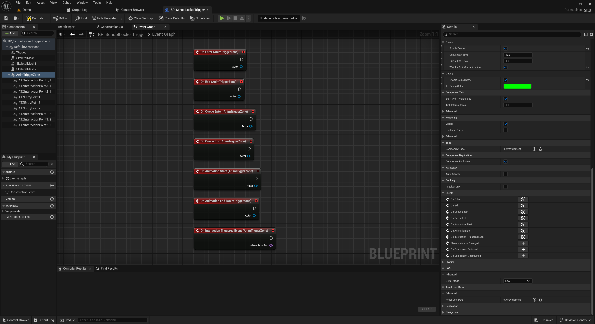
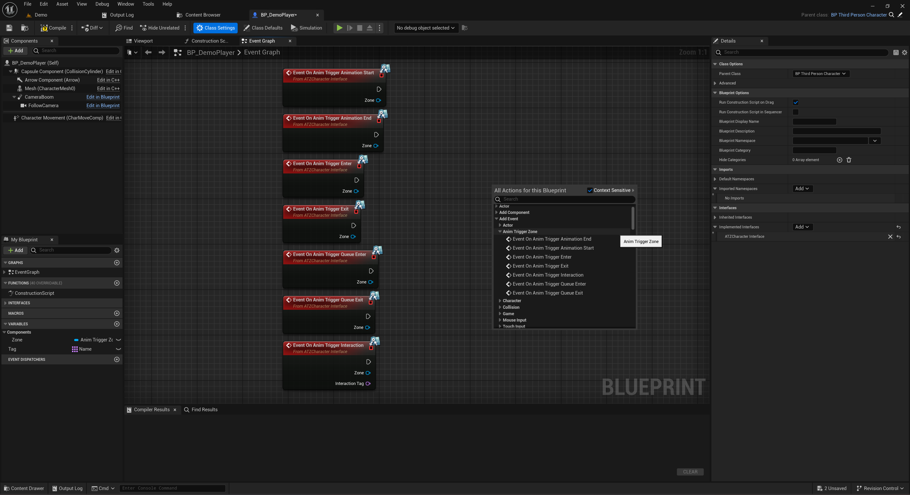
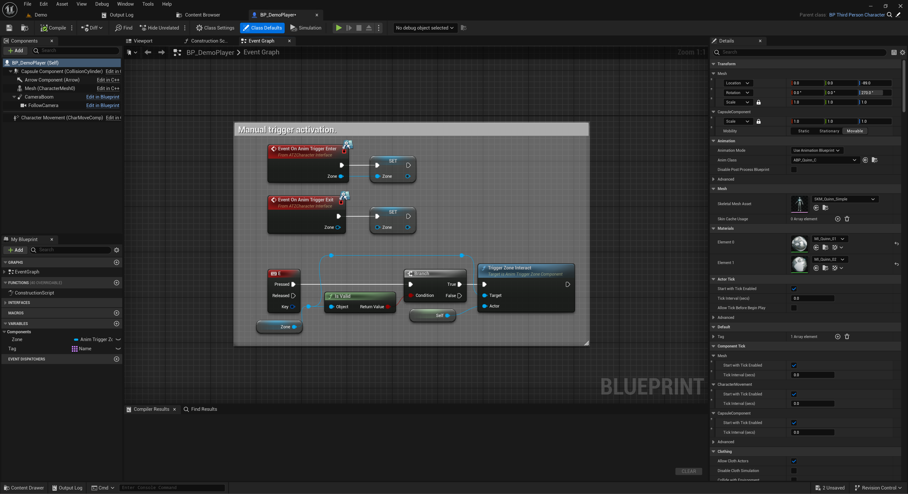
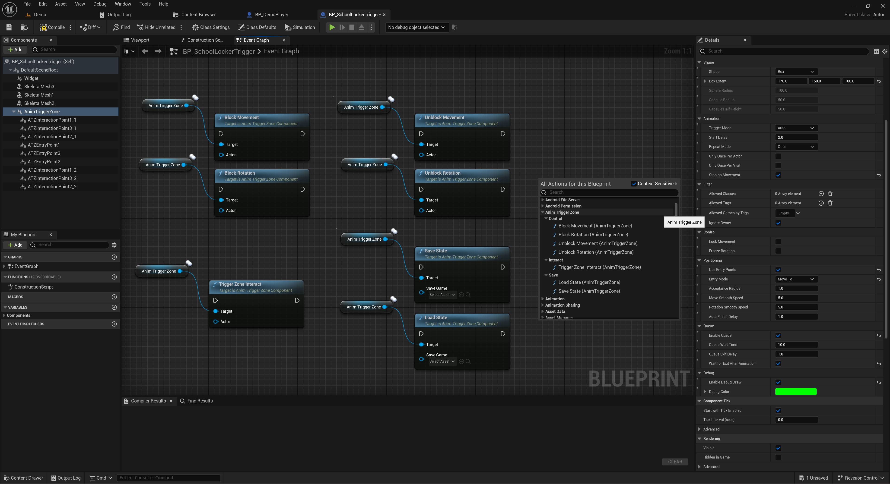

# Blueprint Events & Interfaces

This section explains how to use Blueprint events and the `ATZCharacterInterface` to integrate your character or objects with Animation Trigger Zones.

---

## Built-in Blueprint Events

The `UAnimTriggerZoneComponent` exposes several assignable events.

### Available Events

| Event Name               | Triggered When...                           |
|--------------------------|----------------------------------------------|
| **OnEnter**              | Actor enters the trigger zone                |
| **OnExit**               | Actor exits the trigger zone                 |
| **OnAnimationStart**     | Animation montage starts playing             |
| **OnAnimationEnd**       | Animation montage ends or is interrupted     |
| **OnQueueEnter**         | Actor is added to the waiting queue          |
| **OnQueueExit**          | Actor is removed from the queue              |
| **OnInteractionTriggeredEvent** | An `ATZInteraction` notify fires     |



These can be used like any Blueprint dispatcher:
```blueprint
Bind Event to OnAnimationStart
→ Play Sound / Trigger Logic / etc.
```

---

## Character Interface (`ATZCharacterInterface`)

To receive zone-related callbacks directly in your Blueprint character, implement the `ATZCharacterInterface`.

### How to implement

1. Open your character Blueprint.
2. Add `ATZCharacterInterface` under **Class Settings** → **Interfaces**.
3. Implement any of the following events:

### Available Interface Events

- `OnAnimTriggerEnter(Zone)`
- `OnAnimTriggerExit(Zone)`
- `OnAnimTriggerQueueEnter(Zone)`
- `OnAnimTriggerQueueExit(Zone)`
- `OnAnimTriggerAnimationStart(Zone)`
- `OnAnimTriggerAnimationEnd(Zone)`
- `OnAnimTriggerInteraction(Zone, InteractionTag)`



### Recommended usage

In `OnAnimTriggerEnter`, store the passed `Zone` reference to a variable. This allows you to later call `Trigger Zone Interact` manually.

```blueprint
Event OnAnimTriggerEnter (Zone)
→ Set MyCurrentZone = Zone
```

Then on button press:

```blueprint
Event OnButtonPressed
→ MyCurrentZone → Trigger Zone Interact (Self)
```

---

## Triggering Zones Manually

If using **Manual** trigger mode, call this function:

```blueprint
Target: Zone Component → Trigger Zone Interact (Actor)
```

Pass in the actor that should play the animation (usually `Self`).



---

## Other Zone Functions

You can also call:

- `Block Movement` / `Unblock Movement`
- `Block Rotation` / `Unblock Rotation`
- `Save State` / `Load State`

Useful if you want precise control via Blueprints.



---

➡️ Next: [Advanced Features](advanced.md)