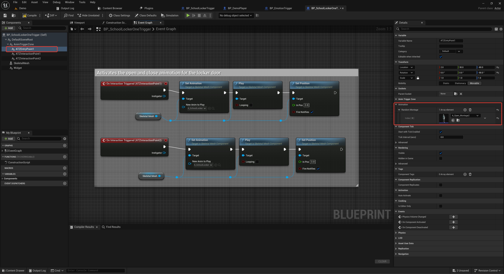
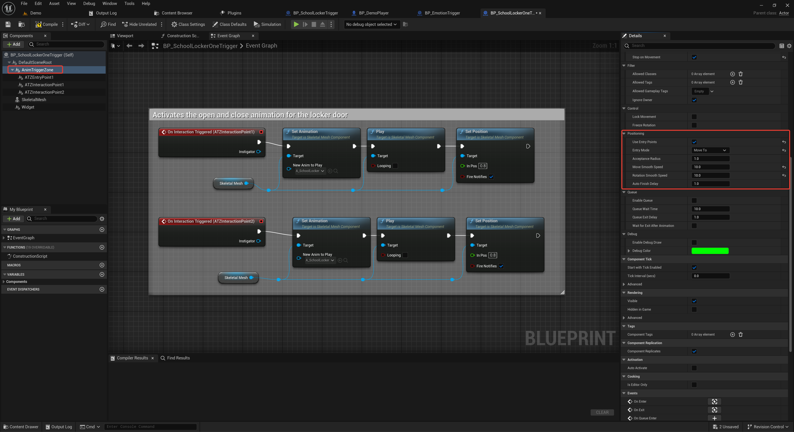
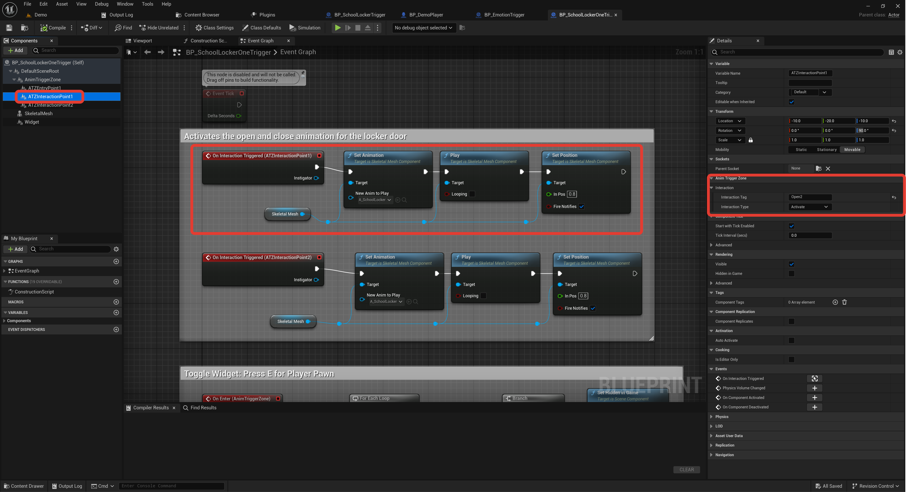

# Entry Points & Interactions

This section explains how to position actors before animations and trigger logic using animation notifies, using the **AnimTriggerZone** component and its child components.

---

## Entry Points (`ATZEntryPoint`)

Entry points define where an actor should go before playing their animation and also provide the animation(s) to play.

### How to add an Entry Point

1. Select the actor that contains your `AnimTriggerZone`.
2. In the **Details** panel, click **Add Component** → search for `ATZEntryPoint`.
3. Make sure the new entry point is a **child of the `AnimTriggerZone`** in the component hierarchy.
4. Position and rotate it to define where and how the actor should appear.

⚠️ The component **must be a direct child of the `AnimTriggerZone`**, or it will be ignored at runtime.

---

### Assigning Animations

Each entry point defines its own animation list:

- Use the `Random Montage` array inside the `ATZEntryPoint`.
- One or more `AnimMontage` assets must be assigned here.
- If multiple montages are specified, one will be chosen at random.

📌 Every trigger zone must have at least one `ATZEntryPoint` with animations assigned.

---

### Zone Settings

- Enable `Use Entry Points` in the zone component.
- Choose **Entry Mode**:
  - `Teleport`: instantly moves the actor to the entry point.
  - `Move To`: navigates the actor using AI to the entry point.
  
  ⚠️ This requires a Navigation Mesh (NavMesh) to be present in the level. Without it, actors will teleport instead.
  - `None`: skips movement but still uses the animation from entry point.

📌 Only one actor can occupy each entry point at a time. If all are full, the actor is queued (if queuing is enabled).

---

## Interaction Points (`ATZInteractionPoint`)

Interaction points allow you to trigger Blueprint logic from inside an animation, using `ATZInteraction` notifies.

### How to add

1. Add a component `ATZInteractionPoint` to the actor that contains the `AnimTriggerZone`.
2. In the **component hierarchy**, make sure the `ATZInteractionPoint` is a **child of the `AnimTriggerZone`**.
3. In the **Details** panel, assign an `Interaction Tag` (e.g. `"Use"`, `"Fire"`, `"Sit"`).
4. Open your AnimMontage and insert a notify of type `ATZInteraction`.
5. Enter the same tag into the notify.

⚠️ Like entry points, **interaction points must be children of the AnimTriggerZone** to be discovered at runtime.

---

### Triggering Blueprint Logic

Use the `OnInteractionTriggered` event inside the `ATZInteractionPoint`.

💡 You can also use `OnInteractionTriggeredEvent` on the AnimTriggerZone itself to receive tagged notifies globally.

---

## Interaction Types

Each `ATZInteractionPoint` has a **Type** field to categorize the interaction:

- `Activate` — For buttons, terminals, switches
- `Pickup` — For grabbing items or loot
- `Custom` — Anything else you define

You can use this to branch logic in your Blueprints.

---

➡️ Next: [Blueprint Events & Interfaces](blueprints.md)
