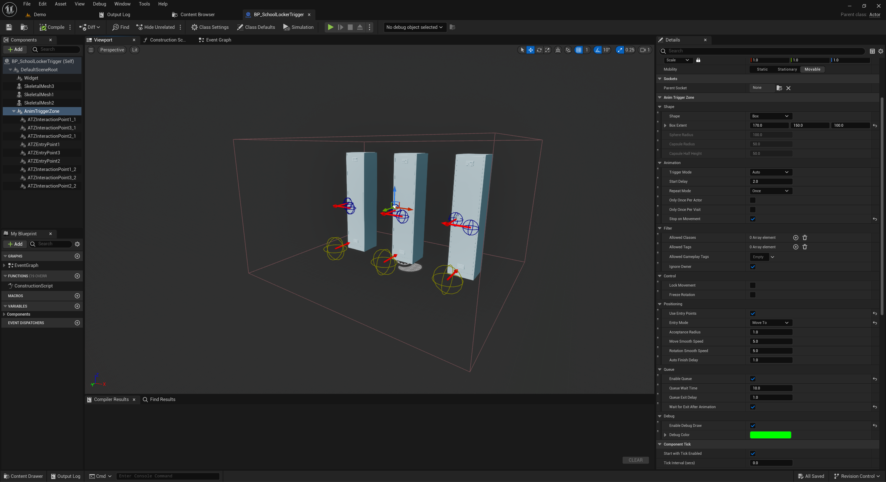

# Animation Trigger Zones

**Animation Trigger Zones** is a powerful Unreal Engine plugin that allows you to trigger animation montages when actors enter specific zones — all without writing a single line of C++.

This plugin is built entirely for Blueprint users and is ideal for:

- NPC interactions and gestures
- Animated cutscenes or scripted behavior
- Entry-based animation logic (e.g., chairs, buttons, terminals)
- Coordinated animations using entry points and queuing

---

## Key Features

✅ 100% Blueprint-Only Workflow  
🎯 Actor filters by class, tags, and gameplay tags  
🚶 Auto or manual animation triggering  
📍 Entry points: `Teleport` or `MoveTo`  
🎞️ Random montage selection per entry point  
🔁 Repeat, loop, or trigger once  
🗣️ Notify-based interaction support with tags  
👥 Queuing system for multi-actor logic  
💾 State saving via `SaveGame`  
🌐 Full multiplayer replication  
🛠️ Debug drawing in runtime and editor

---

## Example Use Cases

- An NPC walks to a terminal and types on a keyboard.
- The player character sits in a chair after entering a zone.
- Guards react with unique animations when players enter a room.
- A vending machine plays a lever-pull animation when used.

---

## Screenshots

  

---

## Getting Started

To get started, follow the quick setup guide:

➡️ [Getting Started →](getting-started.md)

---

## Documentation Overview

- [Getting Started](getting-started.md)  
  Setup the plugin, place zones, assign montages.

- [Trigger Zone Settings](trigger-zone.md)  
  Learn about shape, animation, filter, and control settings.

- [Entry Points & Interactions](entry-and-interaction.md)  
  Teleport/move actors and trigger interaction tags.

- [Blueprint Events & Interfaces](blueprints.md)  
  Use built-in events and Blueprint interfaces for clean logic.

- [Advanced Features](advanced.md)  
  Queuing, saving/loading, replication, and debugging.

- [Interactive Demo Overview](examples.md)  
  Walkthrough with sample use cases, queue handling, interaction points, and more.

---

> 🧠 Whether you're building a cutscene, an immersive interaction, or a virtual world full of NPCs — this plugin gives you full animation control with no coding required.
