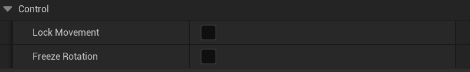
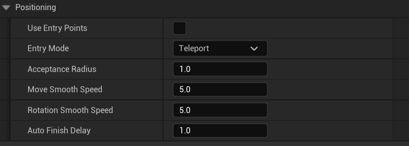
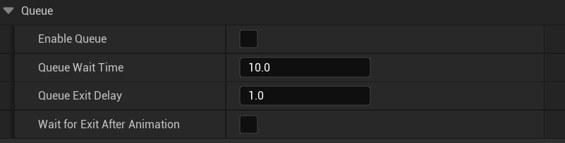

# Trigger Zone Settings

This section explains all configuration options available on the `AnimTriggerZone` component, grouped by category as shown in the Unreal Editor.

---

## Shape

Defines the shape and size of the zone. Only one shape is active at a time.

- **Shape**
  - `Box` / `Sphere` / `Capsule`
- **BoxExtent** *(if Box)* — size of the box in X, Y, Z.
- **SphereRadius** *(if Sphere)* — radius of the sphere.
- **CapsuleRadius** & **CapsuleHalfHeight** *(if Capsule)* — capsule dimensions.

---

## Animation

Controls how and when the animation plays.

- **Trigger Mode**
  - `Auto`: triggers automatically when actor enters.
  - `Manual`: requires explicit call (e.g., via Blueprint).
- **Start Delay** — time in seconds before animation starts.
- **Repeat Mode**
  - `Once`: plays once per actor.
  - `LoopWhileInside`: loops while actor stays inside.
  - `RepeatOnReenter`: plays each time actor re-enters.
- **Only Once Per Actor** — prevents replaying for the same actor.
- **Only Once Per Visit** — only triggers once until actor leaves and re-enters.
- **Stop On Movement** — cancels animation if actor starts moving.

---

## Control

Affects actor behavior during animation.

- **Lock Movement** — disables movement input while playing.
- **Freeze Rotation** — disables look/turn input while playing.

---

## Positioning

Lets the actor move or teleport to a specific point before animation starts.

- **Use Entry Points** — enables entry point logic.
- **Entry Mode**
  - `Teleport`: instantly moves actor to point.
  - `Move To`: walks the actor to the point.
  - `None`: plays animation at current location.
- **Acceptance Radius** — how close actor must get to entry point.
- **Move Smooth Speed** — speed of visual interpolation to point.
- **Rotation Smooth Speed** — speed of rotation to match entry.
- **Auto Finish Delay** — time actor must stand still before animation auto-starts (in Move To mode).

---

## Filter

Restricts which actors can trigger the zone.

- **Allowed Classes** — only actors of these classes can trigger.
- **Allowed Tags** — Actor Tags (e.g., "Player", "NPC").
- **Allowed Gameplay Tags** — GameplayTagContainer.
- **Ignore Owner** — excludes the zone’s owner actor.

---

## Queue

Manages multiple actors waiting to enter.

- **Enable Queue** — enable queue system.
- **Queue Wait Time** — how long an actor must wait before timeout.
- **Queue Exit Delay** — delay between one actor leaving and the next entering.
- **Wait For Exit After Animation** — prevents next actor from starting until previous fully leaves.

---

## Debug

Helps visualize and troubleshoot zones.

- **Enable Debug Draw** — draws zone shape and entry points during gameplay.
- **Debug Color** — color used for debug shapes.

---

➡️ Next: [Entry Points & Interactions](entry-and-interaction.md)