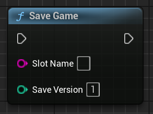
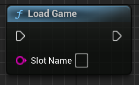
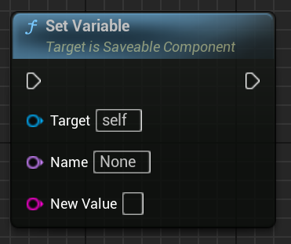
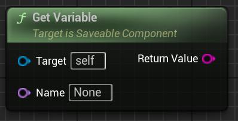
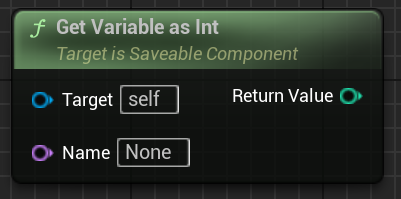
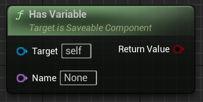
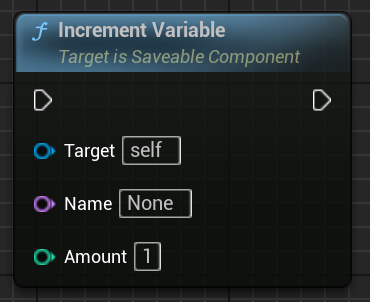
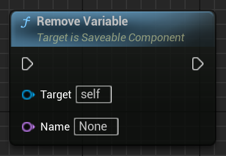
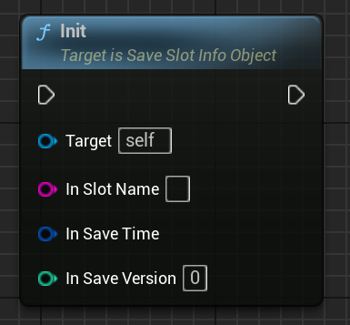

# 📘 Blueprint Function Reference

This section lists all Blueprint-accessible functions provided by SaveKit Lite, grouped by category.

## 🧭 Function Index

- 🔹 [Slots](#-category-save-kit--slots)
- 🔹 [Save/Load](#-category-save-kit)
- 🔹 [Saveable Variables](#-category-save-kit--saveable-component-functions)
- 🧱 [Save Slot Info Object](#-save-slot-info-object)
- 📦 [Notes](#-notes)

---

## 🔹 Category: Save Kit → Slots

### `GetExistingSaveSlots()`
- Returns: `FString[]`
- Description: Lists all save slot names found in the save directory.


### `GetSaveSlotInfos()`
- Returns: `FSaveSlotInfo[]`
- Description: Returns metadata for all existing save slots (slot name, save time, save version).


### `LoadSaveMetadata(SlotName)`
- Input: `FString SlotName`
- Returns: `FSaveSlotInfo`
- Description: Returns metadata only (does NOT load state).  
  See [UI Integration](ui.md) for usage in slot previews.


---

## 🔹 Category: Save Kit

### `SaveGame(SlotName, ``SaveVersion``)`
- Input: `FString SlotName`, `int32 ``SaveVersion``` (optional)
- Description: Saves all actors with a Saveable component to the specified slot.





### `LoadGame(SlotName)`
- Input: `FString SlotName`
- Description: Loads and applies saved actor data from the specified slot.





---

## 🔹 Category: Save Kit → Saveable (component functions)

### `SetVariable(Name)`
- Description: Sets a string variable in the Saveable component.





### `GetVariable(Name)`
- Description: Gets the string value of a saved variable.





### `GetVariableAsInt(Name)`
- Description: Parses the variable’s value as an integer and returns it.





### `HasVariable(Name)`
- Description: Checks whether a variable with the specified name exists.





### `IncrementVariable(Name)`
- Description: Adds the specified amount to the variable’s value (as number).





### `RemoveVariable(Name)`
- Description: Removes the variable from saved state.





---

### 🧱 Save Slot Info Object

### `Init(SlotName, Time, Version)`
- Description: Initializes a SaveSlotInfoObject with name, time and version.





---

## 📦 Notes

- All functions are exposed to Blueprints via context-sensitive search.
- Can be used in:
  - ✅ UMG widgets (`ListView`, `Button`, `Text`)
  - ✅ Actor, Level, or GameMode Blueprints
  - ✅ Custom save/load UI logic

- All function categories are searchable using context-sensitive Blueprint menus.
- You can use these functions inside UMG widgets, level Blueprints, or actor graphs.
