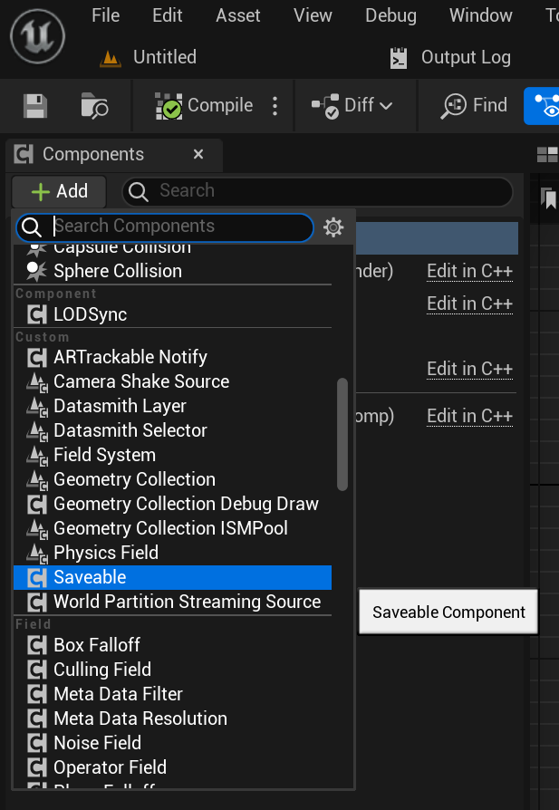
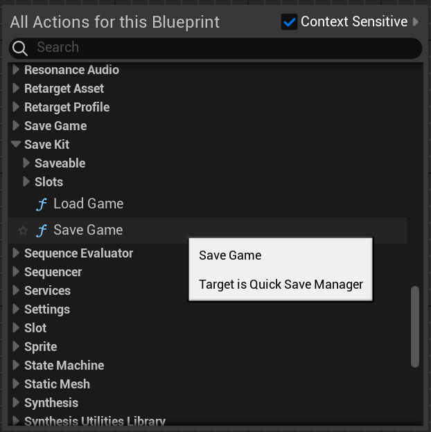
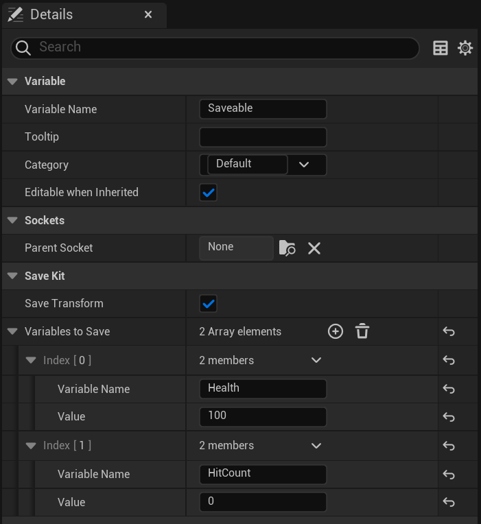

# 🚀 Quick Start

Getting started with **SaveKit Lite** takes just a few steps:

---

## 1. Add the `Saveable` Component

Open the Blueprint of any actor you want to save (e.g. character, item, enemy):

- Click **Add Component**
- Select `Saveable` from the list



---

## 2. Use Blueprint Nodes to Save and Load

Use these nodes in any Blueprint:

- `Save Kit → SaveGame(SlotName)`
- `Save Kit → LoadGame(SlotName)`



---

## 3. Done ✅  
Your actor’s state is now persistent between play sessions.

---

## ⚙️ Advanced Configuration

You can customize the `Saveable` component with the following settings:

| Setting                | Description                                          |
|------------------------|------------------------------------------------------|
| `Save Transform`       | Saves actor's location, rotation, and scale         |
| `Variables To Save`    | Custom key-value string pairs for runtime data      |
| `Apply Control Rotation` | Applies saved actor rotation to the controller (only if owner is a Character with a controller)     |



> 💡 Example `Variables To Save`:

```plaintext
- Health
- IsDamaged
- Score
```

---

> 📌 Need more advanced usage?
>
> See:
> - [Save & Load](save-load.md) — SaveGame, LoadGame, metadata, slot handling
> - [Variables](variables.md) — Working with runtime values like Health or Score
