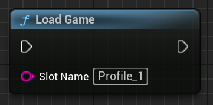
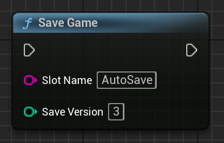

# 💾 Saving & Loading Game State

> 🧭 First time using SaveKit Lite? Start with the [Quick Start guide](quick-start.md)


SaveKit Lite provides simple Blueprint functions to persist and restore actor state across gameplay sessions.

---

Want to store runtime data like counters or flags?
See [Working with Variables](variables.md).

---
## 🔘 Save Game

Use the node:

```
Save Kit → SaveGame(SlotName [, ``SaveVersion``])
```


  
*This Blueprint example saves to slot `Profile_1` with version `1`.*

> 💡 You can use any name as the slot (e.g. `"Main"`, `"Save1"`, `"AutoSave"`)

This will:

- Create or overwrite a save slot with the given name
- Collect all actors in the level with a `Saveable` component
- Store their transform (if enabled), custom variables, tags, and any `SaveGame` properties

---

## 🔁 Load Game

Use:

```
Save Kit → LoadGame(SlotName)
```



  
*Restores the saved state of all matching actors in the current level.*

> ⚠️ Only actors that currently exist in the level and match the saved names will be affected. If an actor was deleted after saving, it will not be restored.

This will:

- Load the specified save slot
- Match actors by name in the current level
- Apply the saved state to each actor that has a `Saveable` component

> ⚠️ Make sure actor names in the level match the saved names.

---

## 🔢 Optional Save Version

The `SaveGame()` node includes an optional second parameter: ```SaveVersion```.

- If not specified, version defaults to `1`
- You can set a custom version manually (e.g. `2`, `5`, `1001`) to track changes in save data format

### Example: versioning use case

> 💡 Use case: migrate old saves
>
> ```blueprint
> if SaveVersion < 2 {
>   ApplyDefaultInventory()
>   NotifyPlayer("Your save has been updated.")
> }
> ```
To detect outdated slots and act accordingly, you could compare `SaveVersion` on load:
```blueprint
if SaveVersion < 2 then ShowWarning()
```


```blueprint
SaveGame(`AutoSave`, 3)
```



  
*This example stores a save under slot ``AutoSave`` with version `3`.*

You can retrieve and display the version later via:

- `GetSaveSlotInfos()` → returns ```SaveVersion``` along with slot name and time
- UI widgets (e.g. `ListView` using `SaveSlotInfoObject`)

---

## 🧠 Use Cases for ``SaveVersion``

- Detect outdated save slots
- Display save version in UI (e.g. `"v2"`)
- Create conditional logic to migrate or reject old saves

---


## 🏷️ What Else Gets Saved?

In addition to Saveable variables, SaveKit Lite also saves:

| Type                        | Notes                                       |
|-----------------------------|---------------------------------------------|
| Transform                  | Saved if `Save Transform` is enabled         |
| Actor Tags                 | Saved automatically                         |
| UPROPERTY(SaveGame) fields | Saved if they support text serialization    |


## 📁 Save Slot Location

In packaged builds, saves are stored under:

```
Saved/SaveGames/
```

This applies to both `.sav` files and their metadata.

> 🛠 You can access these files manually for backup, sync, or debugging purposes.
In packaged builds, this path resolves to `YourProject/Saved/SaveGames/`.

---

## 🔄 What Gets Loaded?

When loading, SaveKit Lite restores the following data for matching actors with a `Saveable` component:

- Actor transform (if `Save Transform` was enabled)
- All `Variables To Save` values
- Actor tags
- Any `SaveGame`-marked properties

> ⚠️ Actors that no longer exist in the level will not be respawned.
