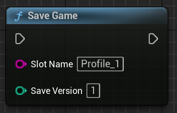

# 💾 Saving & Loading Game State

> 🧭 First time using SaveKit Lite? Start with the [Quick Start guide](quick-start.md)

SaveKit Lite provides simple Blueprint functions to persist and restore actor state across gameplay sessions.

---

Want to store runtime data like counters or flags?  
See [Working with Variables](variables.md).

---

## 🔘 Save Game

Use the node:

```
Save Kit → SaveGame(SlotName [, ``SaveVersion``])
```



*This Blueprint example saves to slot `Profile_1` with version `1`.*

> 💡 You can use any name as the slot (e.g. `"Main"`, `"Save1"`, `"AutoSave"`)

This will:

- Create or overwrite a save slot with the given name
- Collect all actors in the level with a `Saveable` component
- Store their transform (if enabled), custom variables, tags, and any `SaveGame` properties

---

## 🔁 Load Game

Use:

```
Save Kit → LoadGame(SlotName)
```


*Restores the saved state of all matching actors in the current level.*

> ⚠️ Only actors that currently exist in the level and match the saved names will be affected. If an actor was deleted after saving, it will not be restored.

This will:

- Load the specified save slot
- Match actors by name in the current level
- Apply the saved state to each actor that has a `Saveable` component

---

## 🔢 Optional Save Version

The `SaveGame()` node includes an optional second parameter: ```SaveVersion```.

- If not specified, version defaults to `1`
- You can set a custom version manually (e.g. `2`, `5`, `1001`) to track changes in save data format

You can retrieve and display the version later via:

- `GetSaveSlotInfos()` → returns ```SaveVersion``` along with slot name and time
- UI widgets (e.g. `ListView` using `SaveSlotInfoObject`)

---

### 💡 Example Save Version Display

This example stores a save under slot `AutoSave` with version `3`.


---

## 🧠 What Gets Loaded?

When loading, SaveKit Lite restores the following data for matching actors with a `Saveable` component:

- Actor transform (if `Save Transform` was enabled)
- All `Variables To Save` values
- Actor tags
- Any `SaveGame`-marked properties

> ⚠️ Actors that no longer exist in the level will not be respawned.

---

## 📁 Save Slot Location

In packaged builds, saves are stored under:

```
Saved/SaveGames/
```

This applies to both `.sav` files and their metadata.  
> 🛠 You can access these files manually for backup, sync, or debugging purposes.  
Depending on the build configuration, save files are stored in different locations:

### ✅ Windows (Shipping/Development build):
```text
C:\Users\<UserName>\AppData\Local\<ProjectName>\Saved\SaveGames\
```

> This is the default location used by Unreal Engine for local and packaged builds on Windows.