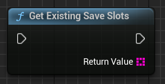
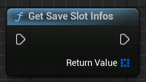
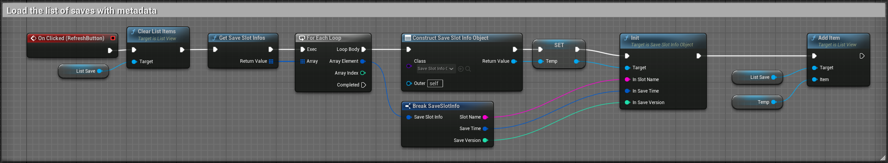
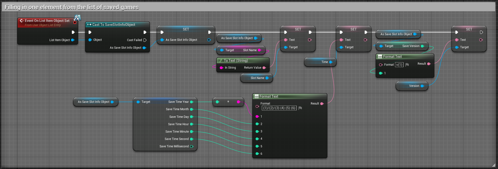
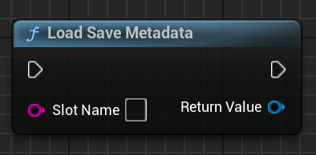

# 🖼️ UI Integration – Displaying Save Slots

SaveKit Lite allows you to display available save slots in a user interface using standard Blueprint nodes.

You can:

- Show all existing save slots (by name)
- Retrieve and display metadata (save time, version)
- Load selected slots from the UI

---

## 📂 1. Show Available Save Slots

Use the node:

```
Save Kit → Slots → GetExistingSaveSlots()
```





This returns an array of `FString` slot names. You can use this to populate a `ListView`, combo box, or buttons dynamically.

---

## 🧠 2. Get Metadata for Each Slot

Use:

```
Save Kit → Slots → GetSaveSlotInfos()
```





This returns an array of `FSaveSlotInfo` structs with:

| Field         | Type       | Description                      |
|---------------|------------|----------------------------------|
| `SlotName`    | `FString`  | Save slot name                   |
| `SaveTime`    | `FDateTime`| Timestamp when the slot was saved|
| ```SaveVersion``` | `int32`    | Format or version indicator      |

Useful for building save/load menus with detailed information.

### 📦 Blueprint Example – Populate ListView

Use this logic to populate a ListView with metadata:





---

## 🧱 3. Display Info in List Entry

Each ListView item can use a `SaveSlotInfoObject` to display save name, time, and version.

> ℹ️ `SaveSlotInfoObject` is a Blueprintable wrapper for slot metadata.
You can create it in Blueprint or receive it from nodes like `LoadSaveMetadata`.

Below is a full example that:

- Displays the save slot name
- Formats and shows the save time using `FormatText`
- Prepends version number like `v1`





*Blueprint setup for `OnListItemObjectSet` inside a ListView entry widget.*

Make sure your widget implements `UserObjectListEntry`, which allows binding metadata to list items.

---

## 🧾 4. Load Metadata for Selected Slot

Use:

```
Save Kit → Slots → LoadSaveMetadata(SlotName)
```





Returns a `SaveSlotInfo` struct for the selected slot. Use it when you want to preview a slot before loading.

---

## 🧩 Summary of UI Nodes (for Blueprints)

These nodes are commonly used to build a save/load UI in UMG using Blueprints:

- `GetExistingSaveSlots()` → returns slot names (`FString[]`)
- `GetSaveSlotInfos()` → returns metadata (`FSaveSlotInfo[]`)
- `LoadSaveMetadata(SlotName)` → metadata for one slot
- `LoadGame(SlotName)` → loads selected slot
- `SaveGame(SlotName)` → saves current actor states to the specified slot

> 🧠 Use these nodes inside Blueprint UMG widgets like `ListView`, `Button`, or `ComboBox`.  
They return strings or structs and require **no C++ code**.

---

## 💡 Tips

- Sort slots by `SaveTime` to show newest first
> 🕒 Recommended display format: `dd.MM.yyyy HH:mm`
> Use the `FormatText` node in Blueprints for localization and styling.
- Format `SaveTime` as ``"dd.MM.yyyy HH:mm"`` for better readability
- Use ``AutoSave`` or ``Profile_1`` as consistent slot names


> 📦 Want to display saved variables too?
> See [Working with Variables](variables.md) for using `GetVariable()` in UI.