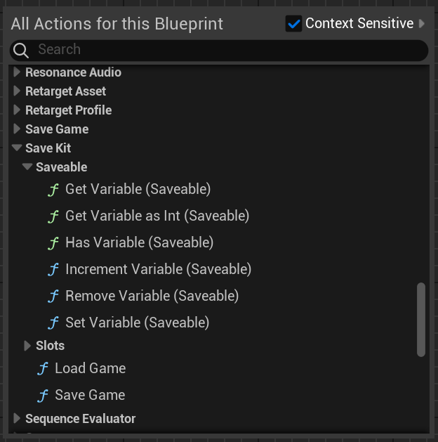
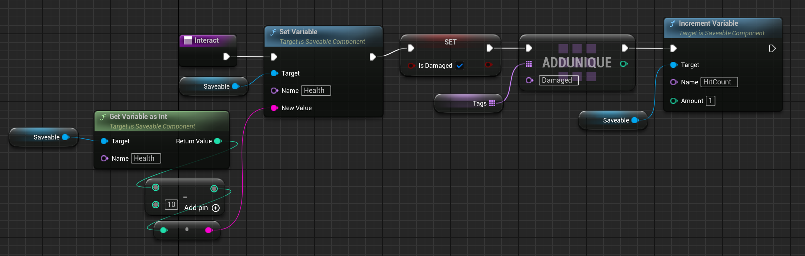
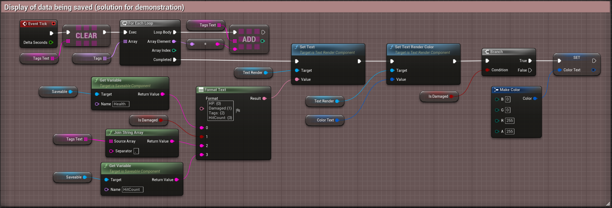

# 🧠 Working with Variables

The `Saveable` component allows storing key-value string pairs during runtime.

---

## 🔁 Blueprint Functions

Available under `Save Kit → Saveable`:

- `SetVariable(Name, Value)` — set a string value at runtime
- `GetVariable(Name)` — get string value
- `GetVariableAsInt(Name)` — parse as integer
- `HasVariable(Name)` — check if variable exists
- `IncrementVariable(Name, Amount)` — add to numeric value
- `RemoveVariable(Name)` — delete variable

---

## ⚙️ Example: Using Saveable Functions

Use Saveable functions to manage data at runtime:

- `SetVariable` — assign a value
- `GetVariableAsInt` — retrieve and modify numeric values
- `IncrementVariable` — track counts or scores

*Example: reducing Health, marking as Damaged, and incrementing HitCount.*

---

## 🆚 Saveable Variables vs SaveGame Properties

| Method                | Defined In             | Access at Runtime      | Saved by SaveKit |
|-----------------------|------------------------|-------------------------|------------------|
| `Saveable` Variables  | Saveable Component     | ✔️ via Blueprint nodes   | ✔️ Yes           |
| `SaveGame` UPROPERTY  | Actor/Blueprint field  | ✔️ directly (Get/Set)    | ✔️ Yes (if serializable) |

Use `Saveable` for flexible runtime state, and `SaveGame` for native Blueprint variables.

> Note: Actor transform, tags, and SaveGame properties are also saved.  
> See [Saving & Loading](save-load.md) for details.

---

## 🧪 Example: Displaying Saved Data

Use `GetVariable`, `Tags`, and `SaveGame` properties to dynamically show state:

*This Blueprint formats and displays Health, HitCount, Tags, and Damaged state.*

---

## ❌ Unsupported Types

- UObject references
- Arrays of objects

Use IDs or reconstruct them manually after loading.

> ℹ️ See [Limitations](limitations.md) for serialization compatibility.