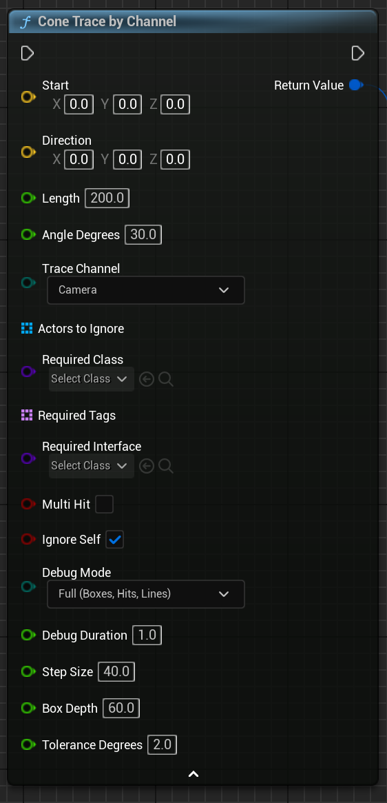

# Smart Cone Trace

**Smart Cone Trace** is a powerful yet simple plugin for Unreal Engine 5 that lets you trace a 3D cone using Blueprint — no coding required.

It’s perfect for things like vision cones, ability areas, and AI detection zones.

- 🎯 Works entirely in Blueprints  
- 🧩 Drop-in scene component  
- 🔁 Runs automatically on a timer  
- 🧠 Filters by tag, class, or interface  
- 🔬 Optional debug visualization  

  
*A cone-shaped trace with debug mode enabled and visible hit points in-game.*

---

## 🚀 Get Started Fast

Want to use Smart Cone Trace in your game?  
Start here: [Quick Start »](quick-start.md)

You’ll be tracing in under 2 minutes.

---

## 🧠 What’s Inside

- A ready-to-use **SmartConeTrace** scene component  
- A flexible `ConeTraceByChannel` Blueprint function  
- Built-in filtering by tags, class, and interface  
- Accurate geometry with step-based tracing  
- Full source code and visual debug support

  
*The SmartConeTrace component shown in the Details panel, along with its event node.*

  
*The ConeTraceByChannel function being used in a Blueprint with sample parameters.*

---

## 📘 Documentation

- [Quick Start](quick-start.md) — Add the plugin and test it right away  
- [Usage](usage.md) — How to use the component and functions  
- [Reference](reference.md) — Parameters and result structure  
- [Examples](examples.md) — Use cases like AI vision and scanning