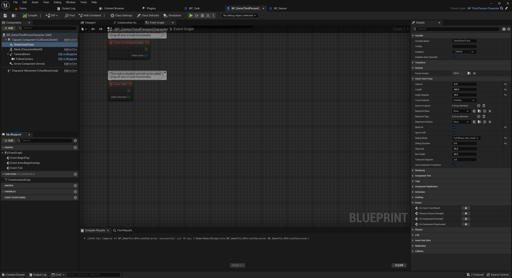

# 🚀 Quick Start

This guide will help you start using **Smart Cone Trace** in less than 2 minutes.

---

## 1. Enable the Plugin

1. Open your Unreal Engine project.
2. Go to `Edit > Plugins`.
3. Search for **Smart Cone Trace** and enable it.
4. Restart the editor if prompted.

*Show the plugin activated in the Plugins window.*

---

## 2. Add the Component

1. Open any Actor Blueprint (like a character or AI pawn).
2. In the Components panel, click **Add Component** and choose `SmartConeTraceComponent`.
3. Select it and tweak the settings in the Details panel:
   - `Interval` — how often the trace runs (e.g. every 0.25 seconds)
   - `Length` — how far the cone reaches
   - `AngleDegrees` — how wide the cone is

*Show the SmartConeTraceComponent selected with parameters like Interval and Length.*

---

## 3. Handle the Result

1. In the Event Graph, right-click the component and choose **"Assign On Cone Trace Result"**.
2. Use the result pin to get hit actors, check if anything was hit, etc.

  
*Show a simple event setup using the result — like printing the closest actor.*

---

## 4. Test It

1. Place the Actor in the level.
2. Hit **Play**.
3. The cone will automatically trace and trigger the event.

If debug mode is enabled, you’ll see lines, boxes, and hit points in the viewport.

  
*Show the cone shape with debug lines and points.*

---

## ✅ Done!

You’re now using Smart Cone Trace in your Blueprint project.

Next:
- Learn how it works in [Usage](usage.md)
- See real examples in [Examples](examples.md)

---
