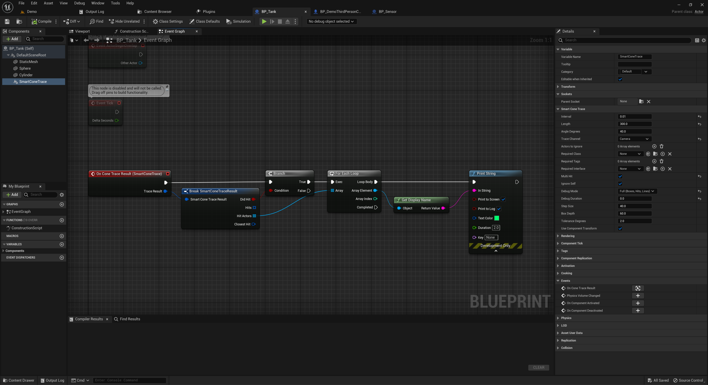

# 🛠️ Usage Guide

This page explains how to use:

- `SmartConeTrace` — the automatic scene component  
- `ConeTraceByChannel()` — the manual Blueprint function  
- All result fields and helper functions

No C++ required — everything is Blueprint-ready.

---

## 🧱 Using the Component

Add the `SmartConeTrace` component to any actor.

It will automatically perform a cone trace every few seconds and call the event `OnConeTraceResult`.

  
*Actor Blueprint using the `SmartConeTrace` component with the `OnConeTraceResult` event.*

---

### 🔧 Component Parameters

All settings can be adjusted in the Details panel.

| Property                 | Description |
|--------------------------|-------------|
| `Interval`               | How often to perform the trace (in seconds). Set to `0` to disable automatic tracing. |
| `Length`                 | How far the cone reaches. |
| `AngleDegrees`           | Width of the cone in degrees (spread). |
| `TraceChannel`           | What object types to trace (e.g. Visibility, Pawn). |
| `ActorsToIgnore`         | Optional list of actors to skip during trace. |
| `RequiredClass`          | Only include hits with this actor class (or child classes). |
| `RequiredTags`           | Only include actors that have any of these tags. |
| `RequiredInterface`      | Only include actors that implement this Blueprint interface. |
| `bMultiHit`              | If `true`, collect all valid hits. If `false`, only use the closest hit per step. |
| `bIgnoreSelf`            | Skip tracing against the owner actor. Usually `true`. |
| `DebugMode`              | Draw the cone in the world (lines, boxes, hit points). Options: `None`, `Basic`, `Full`. |
| `DebugDuration`          | How long to keep the debug visuals on screen (in seconds). |
| `StepSize`               | Distance between each box trace. Smaller = smoother cone. |
| `BoxDepth`               | Length of each individual box trace. |
| `ToleranceDegrees`       | Extra angle margin to accept hits slightly outside the cone. |
| `bUseComponentTransform` | If `true`, the trace starts from the component's position and direction. If `false`, uses the actor’s transform. |
| **`bCheckVisibility`** | If `true`, performs line-of-sight checks on hit actors to ensure they aren't behind walls. |
| **`VisibilityOriginMode`** | Where visibility traces start (`ScreenPoints`, `ScreenCenter`, or `ConeStart`). |

  
*Details panel showing all parameters of the `SmartConeTrace` component.*

---

## 👁️ Visibility & Line of Sight

By default, a cone trace will hit actors even if they are behind walls (because it checks for shape overlap). To prevent this, enable **`bCheckVisibility`**.

When enabled, the plugin performs secondary line traces against every actor found in the cone:

1.  **Origin:** Traces start from the Camera (if set to `ScreenPoints`) or the Cone Origin (if set to `ConeStart`).
2.  **Target:** Traces end at the target actor's center and 8 corners of its bounding box.
3.  **Result:** If any trace reaches the target without being blocked by the `VisibilityChannel`, the actor is added to the **`VisibleActors`** list.

**Usage Tips:**
* **AI Vision:** Set `VisibilityOriginMode` to `ConeStart` so the AI checks visibility from its own eyes/sensor.
* **Player Vision:** Set to `ScreenPoints` to ensure the player can actually see the object on screen.
* **VisibilityBoundsScale:** Reduce this (e.g., 0.8) if you want to require more of the object to be visible to count as a "hit".

---

### ℹ️ About `ActorsToIgnore`

The `ActorsToIgnore` array lets you exclude specific actors from being hit by the cone trace.

> ⚠️ **Important:** This array can only be filled with actors that are **already placed in the scene**.

If you're using the component or calling the `ConeTraceByChannel()` function in Blueprint:

- You **must** select scene-placed actors (e.g. from the World Outliner).
- **You cannot** add dynamically spawned actors or class references directly.
- The actor that owns the trace component or the Blueprint node **must also be in the level** — otherwise, the editor won't let you assign values to `ActorsToIgnore`.

This is a limitation of how the Unreal Editor handles `TArray<AActor*>` in exposed Blueprint properties.

To ignore the owner actor automatically, simply enable `bIgnoreSelf`.

---

### ⚙️ Advanced Settings Tips

- **StepSize** — Smaller values result in a smoother and more precise cone, but increase the number of traces and cost.
- **BoxDepth** — Increase if some actors are being missed between trace steps.
- **ToleranceDegrees** — Add a small margin (1–5°) to catch actors that appear visually inside the cone but technically fall just outside.

---

## 📘 Result Event: `OnConeTraceResult`

This event is triggered after each trace (if interval > 0). It gives you a `SmartConeTraceResult` struct.

### 📦 SmartConeTraceResult Fields

| Field           | Type               | Description |
|-----------------|--------------------|-------------|
| `bDidHit`       | `bool`             | `true` if anything was hit. |
| `Hits`          | `Array<HitResult>` | All filtered hits. |
| `HitActors`     | `Array<Actor>`     | All valid actors that were hit. |
| `ClosestHit`    | `HitResult`        | The closest valid hit among all steps. |
| `VisibleActors` | `Array<Actor>`     | Subset of HitActors that passed the line-of-sight check (requires `bCheckVisibility`).|

  
*Example of printing the name of the closest hit actor using the result.*

---

## ⚙️ Using the Blueprint Function

If you want to trace manually, use `ConeTraceByChannel()` from `SmartConeTraceLib`.

It’s perfect for:

- One-time checks (e.g. on key press)
- Tracing from any point and direction
- Custom cone logic

  
*Calling the `ConeTraceByChannel` function with Start, Direction, and other parameters.*

---

### 🔬 Debug Modes

| Debug Mode | Description |
|------------|-------------|
| `None`     | No visuals |
| `Basic`    | Lines + hit points |
| `Full`     | Boxes, lines, hit points (most detailed) |

  
*In-game view showing a fully visualized cone and hit points in Full debug mode.*

---

## 🧠 Helper Functions

You can use these helper functions from `SmartConeTraceLib` to work with the result:

| Function                        | What it does |
|---------------------------------|---------------|
| `GetClosestHitActor(Result)`    | Returns the actor from `Result.ClosestHit`, or `null`. |
| `WasActorHit(Result, Actor)`    | Returns `true` if the given actor is in the hit list. |
| `GetFirstValidHitActor(Result)` | Returns the first actor from the `HitActors` array. |
| `GetHitActorsByClass(Result, Class)` | Filters hit actors by class. |
| `IsValidHit(Result)`            | Returns `true` if `Result.bDidHit` is `true`. |
| `GetVisibleActors(Result)`      | Returns array of actors visible via line-of-sight. |
| `IsActorVisible(Result, Actor)` | Returns `true` if the actor passed the visibility check. |

  
*Helper functions available in Blueprint for working with Smart Cone Trace results.*